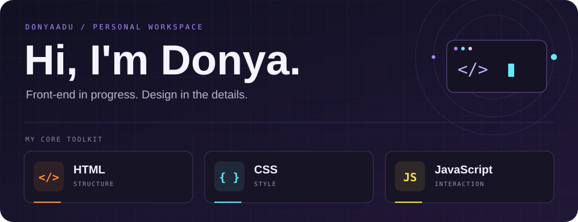

## About

I’m Donya, a front-end learner who enjoys turning everyday ideas into clean, interactive websites. I build with HTML, CSS, and JavaScript, with an eye for layout, motion, and the small details.

**Currently exploring** · Responsive design · JavaScript interactions · UI fundamentals

## Projects

<table>
<tr>
<td width="50%" valign="top">
01 / Webcam / Canvas
<h3><a href="https://github.com/DonyaAdu/photo-booth-">Photo Booth</a></h3>

Three shots. One classic photo strip.

</td>
<td width="50%" valign="top">
02 / SVG / JavaScript
<h3><a href="https://github.com/DonyaAdu/BMI">BMI Visualizer</a></h3>

Body measurements in an interactive dashboard.

</td>
</tr>
<tr>
<td width="50%" valign="top">
03 / Everyday tools
<h3><a href="https://github.com/DonyaAdu/modern-shopping-list">Shopping List</a></h3>

A modern take on your everyday shopping list.

</td>
<td width="50%" valign="top">
04 / Planning / UI
<h3><a href="https://github.com/DonyaAdu/planner">Planner</a></h3>

A little more order for your daily tasks.

</td>
</tr>
<tr>
<td width="50%" valign="top">
05 / Weather API
<h3><a href="https://github.com/DonyaAdu/Weather-Forecast">Weather Forecast</a></h3>

Current conditions and the forecast ahead.

</td>
<td width="50%" valign="top">
06 / Dashboard / Themes
<h3><a href="https://github.com/DonyaAdu/Resume-Dashboard">Resume Dashboard</a></h3>

Keep job applications and their status organized.

</td>
</tr>
<tr>
<td width="50%" valign="top">
07 / Responsive UI
<h3><a href="https://github.com/DonyaAdu/advance-calculator">Advanced Calculator</a></h3>

A modern, interactive calculator experience.

</td>
<td width="50%" valign="top">
08 / JavaScript / Keyboard
<h3><a href="https://github.com/DonyaAdu/Calculator">Calculator</a></h3>

Everyday math with keyboard support.

</td>
</tr>
</table>

[Profile README & animated assets](https://github.com/DonyaAdu/DonyaAdu) · [Browse all repositories](https://github.com/DonyaAdu?tab=repositories)

---

**Have something in mind? Let’s connect.**

